# Agents by Valentine RF - Topology Diagrams

**Prepared for:** Workflow Analyst Review  
**Version:** 1.0  
**Date:** January 1, 2026

This document contains Mermaid diagrams for visual representation of system topology, workflows, and data flows.

---

## 1. System Architecture Diagram

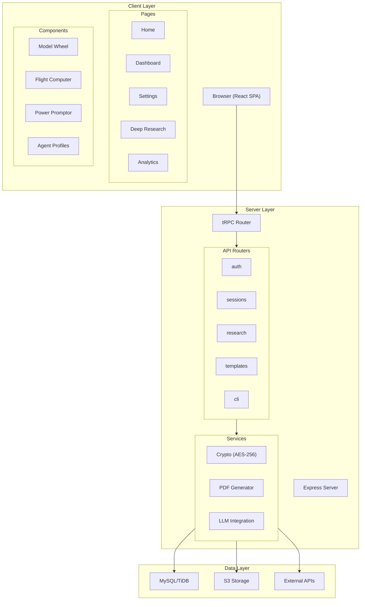

---

## 2. User Authentication Flow

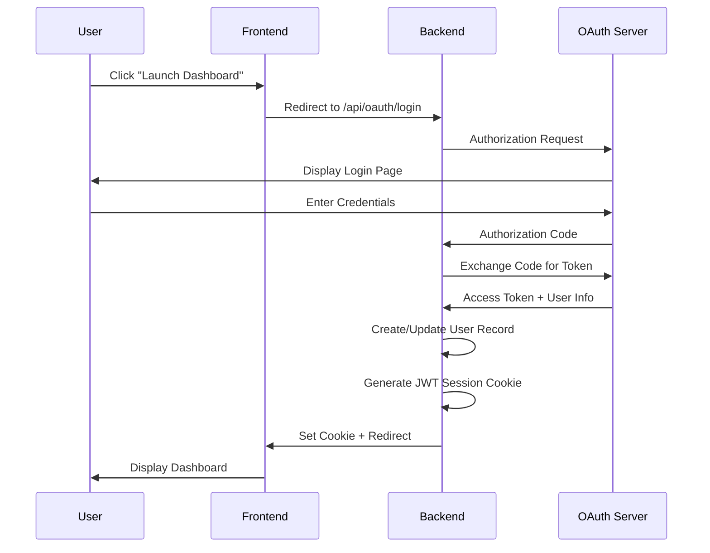

---

## 3. RALPH Loop Execution Flow

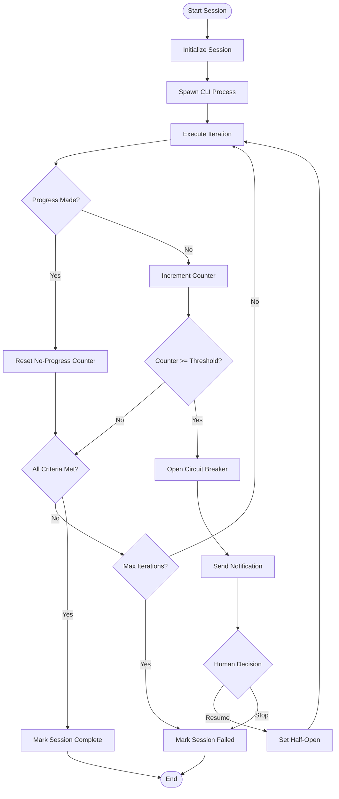

---

## 4. Deep Research Workflow

```mermaid
flowchart LR
    subgraph Input["User Input"]
        Topic["Research Topic"]
        Depth["Depth Selection"]
        Template["Template (Optional)"]
    end

    subgraph Planning["Planning Phase"]
        CreateSession["Create Session"]
        GeneratePlan["LLM: Generate Plan"]
        StorePlan["Store Planning Step"]
    end

    subgraph Research["Research Phase"]
        ExecuteSearch["Execute Searches"]
        AnalyzeSources["LLM: Analyze Sources"]
        ExtractFindings["Extract Findings"]
        StoreFindings["Store Findings"]
    end

    subgraph Synthesis["Synthesis Phase"]
        CompileResults["Compile Results"]
        GenerateSummary["LLM: Generate Summary"]
        CreateRecs["Create Recommendations"]
    end

    subgraph Output["Output"]
        DisplayResults["Display Results"]
        Export["Export (MD/PDF)"]
        Share["Share Link"]
        FollowUp["Follow-up Q&A"]
    end

    Topic --> CreateSession
    Depth --> CreateSession
    Template --> CreateSession
    
    CreateSession --> GeneratePlan
    GeneratePlan --> StorePlan
    StorePlan --> ExecuteSearch
    
    ExecuteSearch --> AnalyzeSources
    AnalyzeSources --> ExtractFindings
    ExtractFindings --> StoreFindings
    StoreFindings --> CompileResults
    
    CompileResults --> GenerateSummary
    GenerateSummary --> CreateRecs
    CreateRecs --> DisplayResults
    
    DisplayResults --> Export
    DisplayResults --> Share
    DisplayResults --> FollowUp
```

---

## 5. Template Management Flow

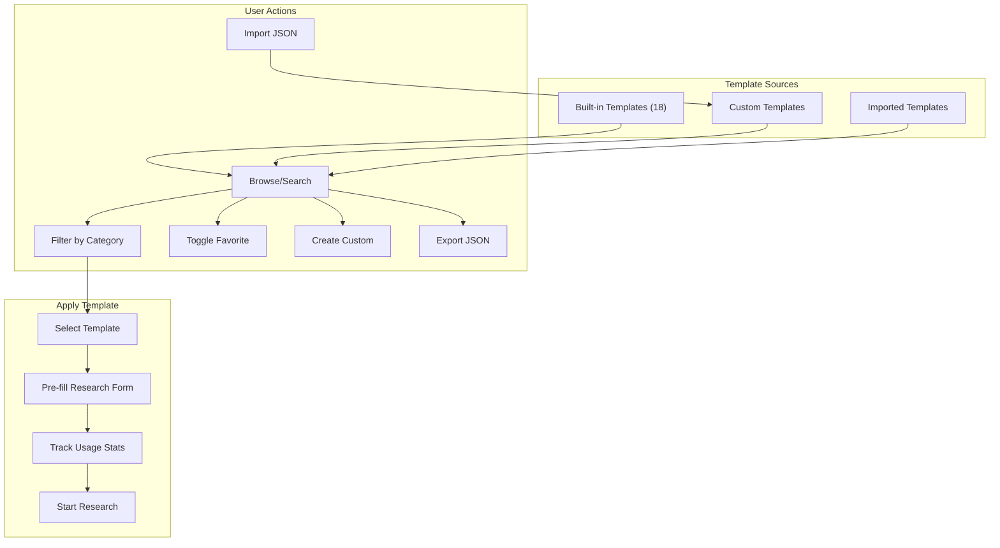

---

## 6. Circuit Breaker State Machine

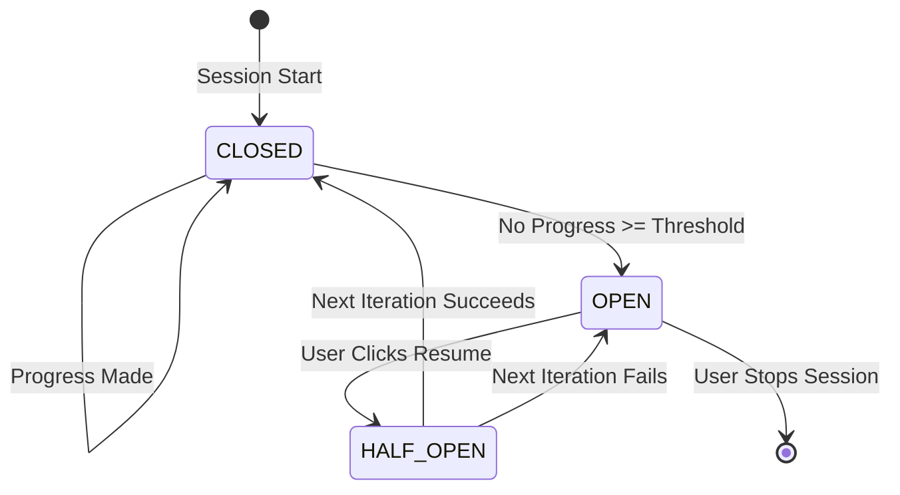

---

## 7. Session State Machine

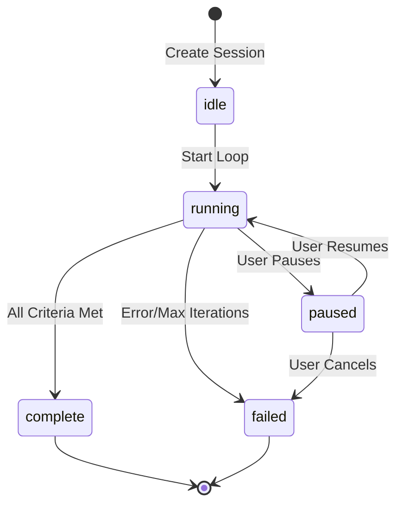

---

## 8. Data Flow Diagram

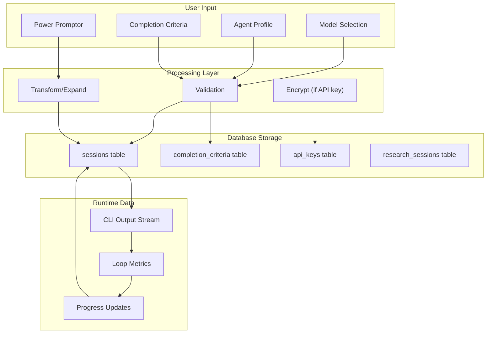

---

## 9. API Request Flow

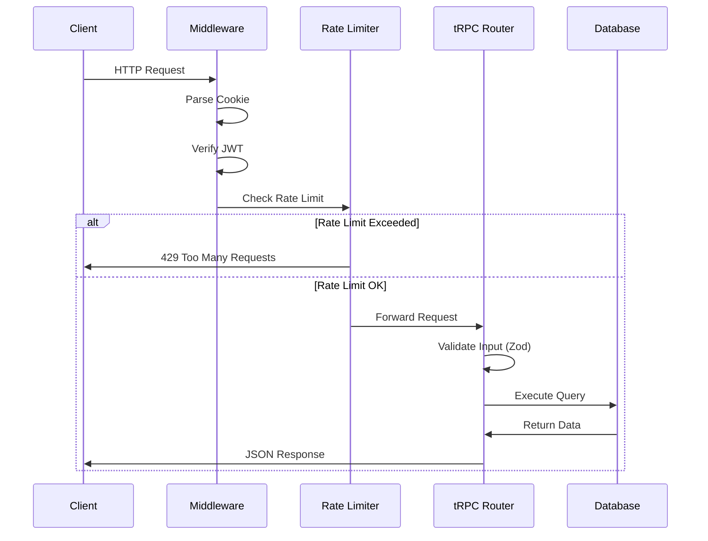

---

## 10. Component Hierarchy

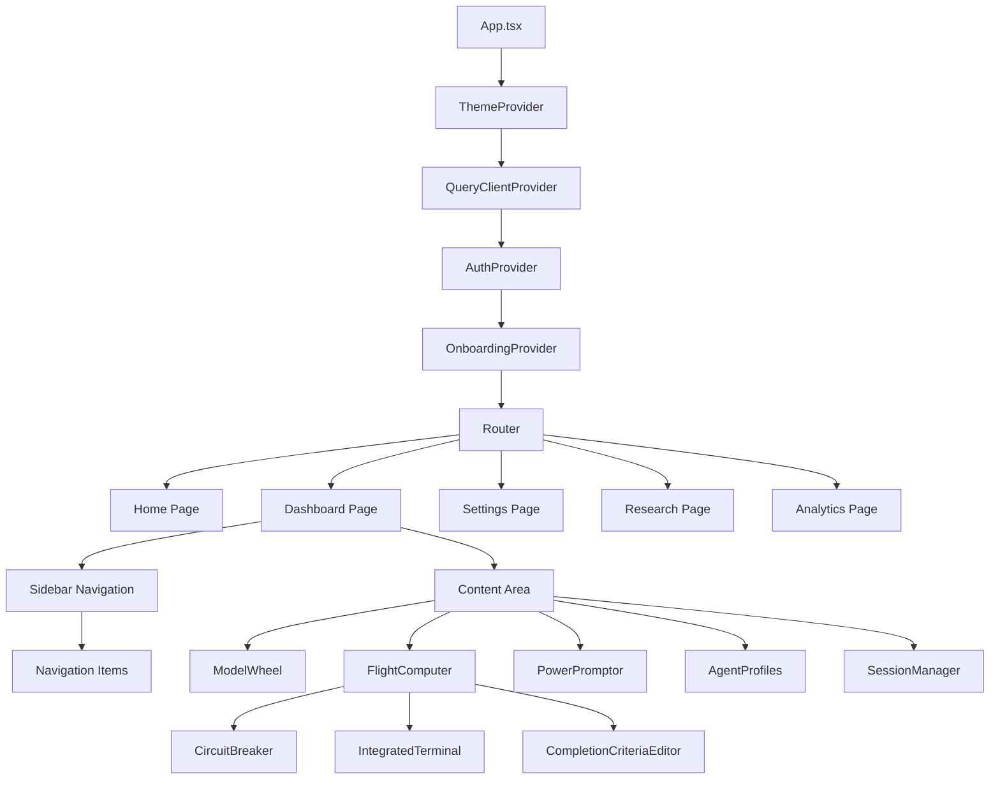

---

## 11. Database Entity Relationships

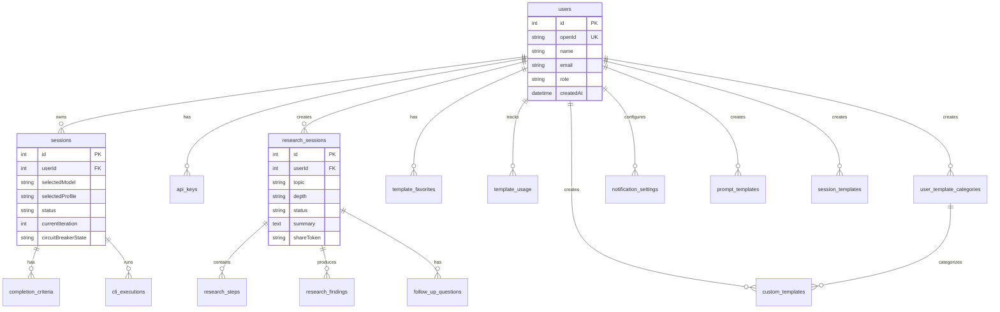

---

## 12. Notification Flow

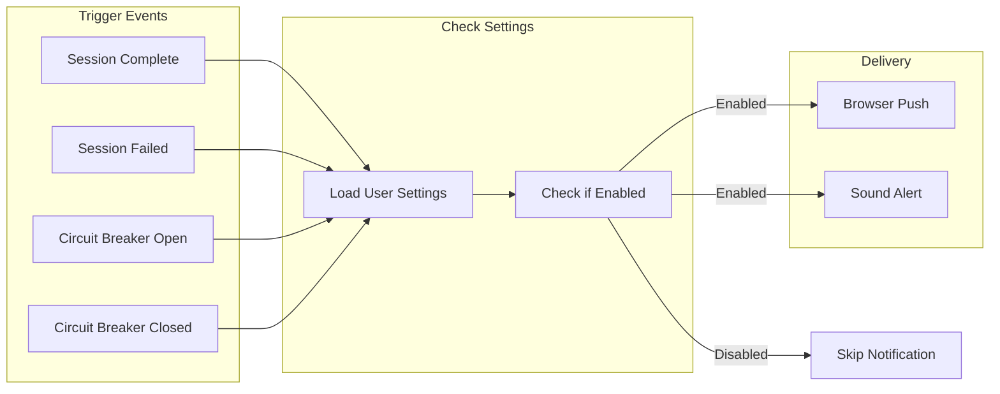

---

## 13. Export Flow

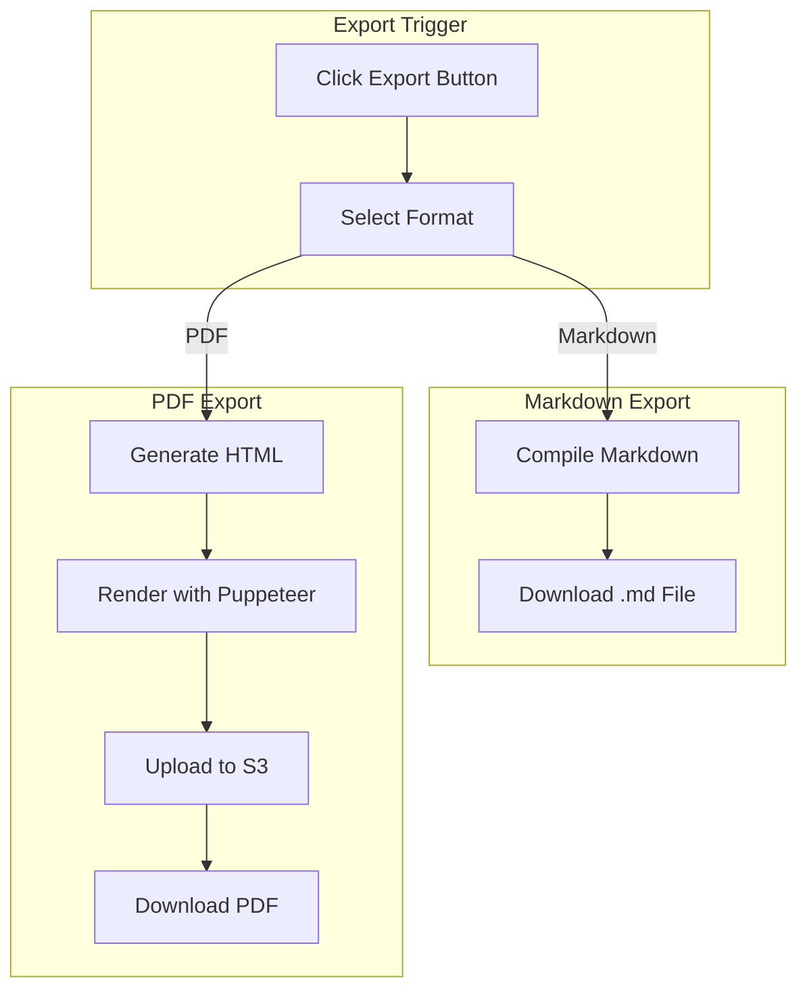

---

## Usage Instructions

These Mermaid diagrams can be rendered in:

1. **GitHub/GitLab** - Native Mermaid support in markdown files
2. **VS Code** - With Mermaid preview extensions
3. **Mermaid Live Editor** - https://mermaid.live/
4. **Documentation tools** - Docusaurus, MkDocs, etc.

To generate PNG images from these diagrams, use the `manus-render-diagram` utility:

```bash
manus-render-diagram TOPOLOGY_DIAGRAMS.md output.png
```

---

*Document prepared for workflow analyst optimization review*
